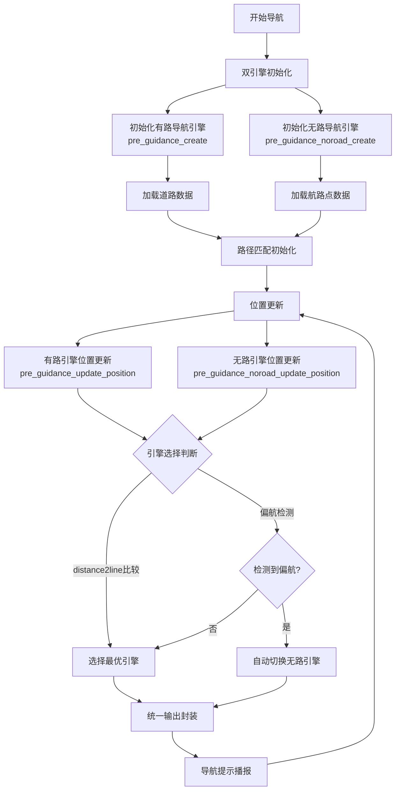
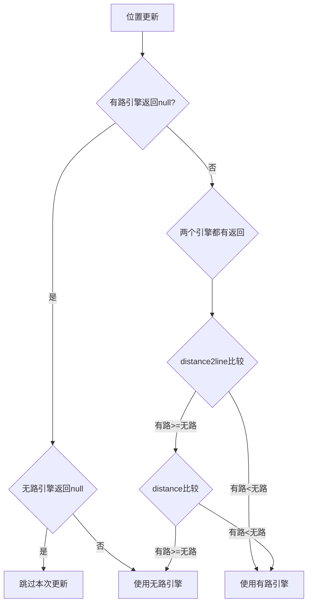
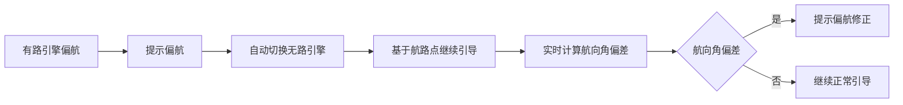

```mermaid
graph TD
    A[开始导航] --> B[双引擎初始化]
    B --> C[初始化有路导航引擎<br/>pre_guidance_create]
    B --> D[初始化无路导航引擎<br/>pre_guidance_noroad_create]
    C --> E[加载道路数据]
    D --> F[加载航路点数据]
    E --> G[路径匹配初始化]
    F --> G
    G --> H[位置更新]
    H --> I[有路引擎位置更新<br/>pre_guidance_update_position]
    H --> J[无路引擎位置更新<br/>pre_guidance_noroad_update_position]
    I --> K{引擎选择判断}
    J --> K
    K -->|distance2line比较| L[选择最优引擎]
    K -->|偏航检测| M{检测到偏航?}
    M -->|是| N[自动切换无路引擎]
    M -->|否| L
    L --> O[统一输出封装]
    N --> O
    O --> P[导航提示播报]
    P --> H
    
```

```mermaid
graph TD
	A[位置更新] --> B{有路引擎返回null?}
	B -->|是| C{无路引擎返回null}
	B -->|否| D{两个引擎都有返回}
	C -->|是| E[跳过本次更新]
	C -->|否| F[使用无路引擎]
	D --> G{distance2line比较}
	G -->|有路<无路| H[使用有路引擎]
	G -->|有路>=无路| I{distance比较}
	I -->|有路<无路| H
	I -->|有路>=无路| F

```

```mermaid
graph LR
	A[有路引擎偏航] --> B[提示偏航]
	B --> C[自动切换无路引擎]
	C --> D[基于航路点继续引导]
	D --> E[实时计算航向角偏差]
	E --> F{航向角偏差}
	F -->|是|G[提示偏航修正]
	F -->|否|H[继续正常引导]
```

