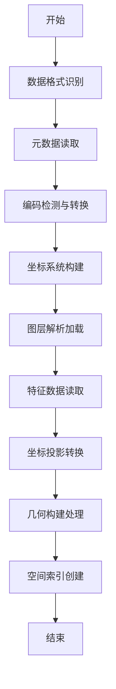

```mermaid
graph TD
    A[开始] --> B[数据格式识别]
    B --> C[元数据读取]
    C --> D[编码检测与转换]
    D --> E[坐标系统构建]
    E --> F[图层解析加载]
    F --> G[特征数据读取]
    G --> H[坐标投影转换]
    H --> I[几何构建处理]
    I --> J[空间索引创建]
    J --> K[结束]
```

