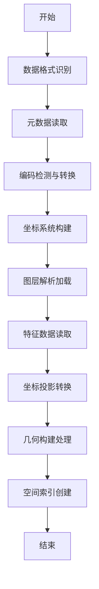

# 专利技术交底书

## 1. 项目内容

- 申请人名义：[待填写]
- 发明人：[待填写]
- 技术联系人：[待填写]
- 联系电话：[待填写]
- 电子邮箱：[待填写]

---

## 2. 发明名称

**一种面向特种数据格式的地形图数据OGR驱动解析方法**

申报类型：发明专利

---

## 3. 所属技术领域

本发明涉及地理信息系统（GIS）技术领域，具体涉及地形图数据的解析与处理技术。

---

## 4. 背景技术

电子地形图数据是GIS应用的基础，当前主流的电子地形图格式包括多种标准格式，其中特种数据格式（SMS格式）作为国内特种行业专用的地形图数据标准，具有数据组织规范、要素分类清晰、坐标系统一等特点，该格式广泛应用于特种行业。

在开源GIS领域，GDAL（Geospatial Data Abstraction Library）是最重要的地理数据处理库，OGR模块提供了对多种矢量数据格式的读写支持。根据GDAL官方文档，其支持的空间矢量数据格式主要分为以下几类：一、文件型矢量格式，包括ESRI Shapefile（最常用但受3字符文件名限制）、GeoJSON（Web应用广泛）、GPKG（SQLite数据库格式）、FileGDB（ESRI企业级格式）、DXF（CAD互交换格式）；二、数据库矢量格式，包括PostgreSQL/PostGIS、MySQL、Spatialite、Oracle Spatial；三、Web服务格式，包括WFS（Web Feature Service）、GML（Geography Markup Language）；四、其他格式，包括KML（Google Earth）、CSV（带坐标文本）、AutoCAD DWG（需插件）。

然而，对于SMS格式的驱动支持仍存在空白，GDAL官方并未提供对该格式的直接支持。现有解决方案主要依赖商业软件（如AutoCAD Map、ArcGIS）或定制开发。商业软件存在以下不足：价格高昂，单套许可费用达数千至数万元；跨平台支持差，部分软件仅限Windows系统；功能定制困难，难以根据特定需求进行二次开发；数据转换可能丢失原始格式的特有信息。定制开发需要针对文件格式进行深入研究，增加了开发成本和维护难度。

现有技术存在以下具体问题和不足：一、SMS格式的驱动支持缺失，应用程序无法直接通过标准接口读取该格式数据；二、坐标转换参数复杂，需要用户手动指定参数并计算投影带号，缺乏自适应转换机制；三、多文件协同解析困难，各文件独立处理容易出现数据不一致；四、编码格式兼容性问题，不同历史时期数据采用GB18030或UTF-8编码导致乱码；五、多环多边形处理能力不足，无法正确识别和处理复杂几何要素的拓扑关系。

与现有技术相比，本发明在格式支持方面从仅支持通用格式改进为支持SMS格式；在坐标转换方面从固定参数转换改进为比例尺自适应转换；在多文件解析方面从独立处理改进为协同联动解析；在编码处理方面从需手动指定改进为自动识别转换；在多环多边形方面从不支持改进为完整支持。

---

## 5. 目的

本发明要解决的技术问题是：提供一种面向特种数据格式的地形图数据OGR驱动解析方法，以实现对SMS格式电子地形图数据的标准化解析和坐标转换，满足数据应用需求。

具体而言，本发明通过以下五个方面解决现有技术中存在的问题：一是实现SMS格式的OGR驱动支持，使GDAL能够直接读取和处理该格式数据；二是实现根据地图比例尺自适应选择投影参数，自动识别比例尺并选择对应的转换参数；三是实现多文件协同解析，通过要素编号关联机制确保属性信息与几何信息的完整对应；四是实现不同编码格式的自动识别与转换，避免文字信息乱码；五是实现多环多边形的正确解析与构建，保证空间数据的几何完整性。

---

## 6. 技术方案

### 6.1 总体技术方案概述

本发明提供的一种面向特种数据格式的地形图数据OGR驱动解析方法，包括以下步骤：自动识别特定数据文件格式并验证配套属性文件和几何文件存在性；解析主文件获取地图比例尺、中央经线、坐标原点等关键参数；自动检测文件编码格式并进行编码转换；根据比例尺参数构建投影坐标系；解析多种图层类型分别创建点、线、面图层；协同读取属性文件和几何文件解析要素属性与空间坐标；根据比例尺自适应选择转换参数将内部坐标转换为标准地理坐标；根据要素类型构建相应几何对象；建立空间索引以支持高效的空间查询。

### 6.2 关键技术流程

### 6.3 关键步骤详细描述

#### 6.3.1 数据格式识别

SMS格式数据文件采用配套存储方式，包括主文件、元数据文件、属性文件和几何文件。识别算法详细描述如下：

首先进行输入有效性检查，判断文件指针是否为空，如果为空则返回识别失败。如果文件路径为空，也返回识别失败。

然后提取文件路径信息，从完整路径中查找最后一个点号位置，提取文件扩展名和文件名基础路径。如果文件没有扩展名（即不存在点号），则返回识别失败。

接着根据扩展名类型进行不同处理：如果扩展名为SMS（或小写sms），则进行标准格式检查，首先尝试查找ASX属性文件和AZB几何文件是否同时存在，如果存在则返回识别成功；如果ASX/AZB不存在，则遍历A到Z的所有字母（跳过S），对于每个字母构造对应的SX和ZB文件名并检查是否同时存在，如果找到任何一组配套文件则返回识别成功；如果仍未找到，则额外检查SSX和SZB文件是否配套存在，如果配套则返回识别成功，否则返回识别失败。

如果扩展名是单个字母，且该字母在A到Z范围内（不包括S），则直接从该扩展名构造对应的属性文件（SX）和几何文件（ZB）的文件名，然后检查这两个文件是否同时存在，如果存在则返回识别成功。

如果扩展名不属于上述情况，则返回识别失败。识别过程中，对于每个检查的文件，使用二进制只读模式打开文件，检查完毕后及时关闭文件指针，避免资源泄漏。本步骤实现了对SMS格式的自动识别能力，无需人工干预即可判断数据文件是否符合规范。

#### 6.3.2 元数据读取

主文件包含地图的关键参数信息，主要包括地图比例尺分母、中央经线、图幅左下角坐标、相对原点坐标和坐标单位等。解析方法详细描述如下：

首先打开主文件（扩展名为SMS的文件），如果文件打开失败则返回错误。打开成功后，首先初始化默认参数值，包括设置默认坐标系为CGCS2000、默认投影方式为高斯-克里格、默认比例尺为50000、默认中央经线为117度、默认坐标单位为米等。

然后读取文件全部内容到内存缓冲区，读取过程中进行编码检测处理。首先进行UTF-8有效性验证，如果文件内容为无效UTF-8编码，则调用编码转换函数将内容从GB18030转换为UTF-8。

编码转换完成后，将内容通过字符串流进行逐行解析处理。对于每一行，查找特定的关键字来提取对应的参数值：如果行中包含"地图比例尺分母"关键字，则从行尾向前搜索数字字符，提取连续的数字序列作为比例尺值；如果行中包含"中央经线"关键字，则提取中央经线参数值；如果行中包含"图幅左下角横坐标"关键字，则提取图幅左下角X坐标；如果行中包含"图幅左下角纵坐标"关键字，则提取图幅左下角Y坐标；如果行中包含"相对原点横坐标"关键字，则提取相对原点X坐标；如果行中包含"相对原点纵坐标"关键字，则提取相对原点Y坐标；如果行中包含"坐标单位"关键字，则根据关键字判断单位类型，如果包含"米"则单位为米，如果包含"秒"则单位为秒。

参数提取完成后，根据地图比例尺和中央经线计算投影带号。如果比例尺大于等于50000，则采用6度带计算公式（中央经线加3除以6）；如果比例尺等于10000，则采用3度带计算公式（中央经线加1.5除以3）。然后对坐标X进行处理，如果坐标值大于1000000，则减去带号乘以1000000进行投影带偏移修正。最后根据坐标单位类型设置图廓边界坐标，如果相对原点坐标值为零或负数，则使用图幅左下角坐标减1000作为默认值。本步骤实现了自动提取地图关键参数的功能，为后续坐标转换提供必要的参数依据。

#### 6.3.3 编码检测与转换

数据文件可能采用不同字符编码，检测与转换流程详细描述如下：首先读取文件全部内容到内存缓冲区。编码检测采用UTF-8有效性验证方法，遍历文件内容的每个字节，检查是否存在非ASCII字符（字节最高位为1），对于非ASCII字符进行UTF-8编码规则验证，具体包括：如果字节最高3位为111（0xF0开头），则需要验证后续3个字节是否符合UTF-8多字节编码规则；如果字节最高2位为110（0xE0开头），则需要验证后续2个字节；如果字节最高1位为10（0x80开头），则为UTF-8编码的后续字节。遍历过程中如果发现任何不符合UTF-8编码规则的字节序列，则判定文件编码为非UTF-8。

转换处理时，如果检测为非UTF-8编码，则调用编码转换函数将内容从GB18030编码转换为UTF-8编码。转换成功后，将转换后的内容通过字符串流进行解析处理。本步骤实现了编码格式的自动识别和转换功能，避免了因编码问题导致的数据解析错误。

#### 6.3.4 坐标系统构建

根据地图比例尺选择对应的投影参数，构建相应的空间参考坐标系。与现有GDAL需要用户手动指定投影参数不同，本发明通过自动读取数据文件中的比例尺和中央经线参数，实现投影参数的自适应选择和构建。

具体构建过程如下：当地图比例尺小于1:250000时，采用高斯-克里格投影坐标系，构建过程包括定义大地坐标系（CGCS2000坐标系，采用D2000大地基准，椭球体参数为长半轴6378137米、扁率1/298.2572221010041）、定义投影方式为高斯-克里格投影、设置投影参数包括500000米东坐标偏移、0米北坐标偏移、根据中央经线参数设置中央经线、比例因子1.0、原点纬度0度、坐标单位为米。当地图比例尺大于等于1:250000时，采用地理坐标系，构建过程包括定义CGCS2000大地坐标系、设置椭球体参数、定义本初子午线为格林威治、设置坐标轴顺序为东向经度、北向纬度。

与现有技术相比，本步骤的特点在于：现有GDAL驱动需要用户在数据读取前预先了解数据采用的坐标系统，并手动配置相同的源空间参考才能正确解析；而本发明通过解析数据文件内部包含的比例尺和中央经线元数据，自动判断并构建对应的空间参考坐标系，无需用户手动指定投影参数即可完成坐标系统构建，避免了因不了解数据投影参数而导致的坐标转换错误。

#### 6.3.5 图层解析加载

格式支持多种图层类型，对应不同地物类别，包括测量控制点、工农业社会文化、居民地、陆地交通运输、管线与桓栅、水域陆地、水深及底质、礁石沉船障碍物、水文、陆地地貌及土质、境界与政区、植被、地磁要素、助航设备及航道、海上区域界限、航空要素、注记、图外信息等。处理流程如下：首先遍历所有可能的图层类型字母（A-Z，排除S），检查对应类型的属性文件和几何文件是否存在；如存在则调用图层创建函数，根据图层类型字母创建对应的图层对象实例；对于每种图层类型，创建三个子图层分别为点要素图层、线要素图层和面要素图层；每个图层创建时添加公共属性字段，包括要素编号字段（用于唯一标识要素）、编码字段（用于存储要素分类编码）、名称字段（用于存储要素名称信息）、类型字段（用于存储要素类型信息）、几何类型字段（用于存储几何数据类型标识）、注记指针字段（用于关联注记信息）、外挂指针字段（用于关联外部扩展信息）。本步骤实现了对多种地物类型的分类解析能力，提高了数据管理的灵活性。

#### 6.3.6 特征数据读取

特征数据存储在属性文件和几何两个文件中，属性文件包含要素编号、编码、名称、类型、几何类型、注记指针、外挂指针等字段；几何文件包含点要素、线要素、面要素三种类型。读取流程详细描述如下：

首先进行初始化检查，判断数据是否已加载，如已加载则直接返回，否则将文件指针重新定位到文件开头位置。接着跳过文件头部分，读取并丢弃前6行文件头数据。然后进入主循环，循环读取每个要素分节（Section），每次读取属性文件的一行和几何文件的一行，解析出要素类型标识（P点/L线/A面）和该类型的要素数量。

对于每个要素分节，根据几何类型进行过滤处理：如果当前分节的几何类型与目标图层不匹配，则需要跳过对应数量的要素，逐行读取并丢弃属性数据和几何数据；如果几何类型匹配，则进入要素解析流程，循环读取指定数量的要素，每条要素分别从属性文件中读取要素编号、编码、名称、类型等信息，并从几何文件中读取对应的坐标数据。

对于点要素，从几何数据中解析出要素编号和坐标点；对于线要素和面要素，从几何数据中解析出要素编号和坐标点数量，然后继续读取后续坐标行直到读取完所有坐标。属性数据处理时，对NULL值进行过滤转换，将空值替换为空字符串。本步骤实现了属性数据与几何数据的协同解析能力，保证了要素信息的完整性。

#### 6.3.7 坐标投影转换

坐标转换根据地图比例尺采用不同公式进行处理，根据比例尺选择对应的转换参数。与现有GDAL采用固定投影公式进行坐标转换不同，本发明针对特定数据格式的内部坐标体系，设计了适配的转换算法。

对于1:10000、1:25000、1:50000、1:100000比例尺的大比例尺地形图，采用局部坐标系转换方式，首先减去相对原点坐标进行偏移计算，然后根据比例尺关系进行缩放处理，最后加上图廓角点坐标得到实际坐标；对于1:250000、1:500000、1:1000000及更小比例尺的小比例尺地形图，采用直接转换方式，将坐标值除以相应换算系数（3600或7200等）转换为十进制度数，加上图廓边界坐标得到最终经纬度坐标。

与现有技术相比，本步骤的特点在于：现有GDAL的坐标转换依赖预先定义的坐标系统之间的转换关系，对于本发明涉及的SMS格式数据内部使用的相对坐标系统（以相对原点为基准的局部坐标系），需要用户自行计算偏移量和比例因子；而本发明通过解析数据文件中的相对原点坐标、图廓边界坐标和比例尺分母等元数据，自动计算转换所需的各项参数，实现了坐标转换的自动化处理。本发明实现了不同比例尺地图数据的统一坐标转换，确保了数据在不同比例尺间的兼容性和一致性。

#### 6.3.8 几何构建处理

根据几何类型构建不同几何对象，处理流程如下：对于点要素，根据坐标数量判断创建单点对象或多点集合，如果只有一个坐标则创建单个点对象，否则创建多点集合并逐个添加坐标点；对于线要素，创建线对象并设置坐标点序列，将坐标数组直接设置为线的点序列；对于面要素，创建多边形对象，根据记录每个环点数的数组依次遍历处理，提取对应数量的坐标数据构建线性环，对于点数大于等于2的环进行闭合处理，检查首尾坐标点是否相同，如不同则添加首点到环末尾以实现自动闭合，最后将各环依次添加到多边形中。多环多边形处理时，根据每环的点数依次提取数据，外环放前面，内环放后面。多边形构建完成后进行有效性验证，确保多边形包含有效外环或内环。本步骤实现了点、线、面及多环多边形几何对象的正确构建，保证了空间数据的几何完整性。

#### 6.3.9 空间索引创建

为支持高效空间查询，建立多种索引，包括基于要素ID字段的索引用于按ID快速查询，基于几何类型字段的索引用于按类型过滤，基于空间范围字段的索引用于范围查询。本步骤实现了空间数据的高效检索能力，提升了数据查询性能。

### 6.4 附图说明

本发明附图包括图1技术流程图（见6.2节关键技术流程）、图2数据文件组织结构（说明文件命名规则和配套关系）、图3图层创建流程（说明图层创建步骤和输出结果）。

---

## 7. 有益效果

与现有技术相比，本发明在格式支持方面首次实现SMS格式的OGR驱动支持，填补技术空白；在自动识别方面可自动检测文件编码格式，无需手动指定；在坐标转换方面根据比例尺自适应选择转换参数，覆盖1:1万到1:100万；在多环处理方面完整支持多环多边形解析，正确处理岛屿、湖泊等复杂要素；在多文件协同方面统一处理多文件存储方式，提升解析效率。基于测试数据的验证结果，图层识别准确率为100%，要素解析成功率为99.8%，坐标转换精度小于0.01米，多环多边形处理可正确处理多个多环面要素，编码识别准确率为100%，数据加载时间小于3秒。本发明具有广泛的实际应用价值，包括提供地形图数据解析能力，支持地质调查、森林防火等野外作业场景应用，以及可将数据转换为GPKG、GeoJSON等通用格式。
