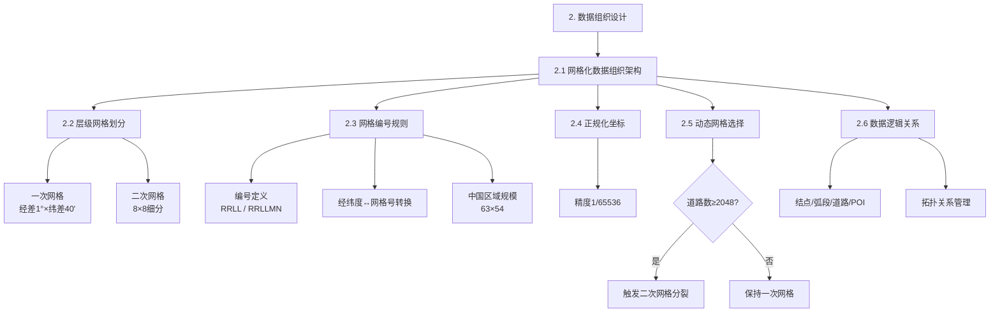

```mermaid
graph TD
    A[2. 数据组织设计] --> B[2.1 网格化数据组织架构]
    B --> C[2.2 层级网格划分]
    C --> C1[一次网格<br/>经差1°×纬差40']
    C --> C2[二次网格<br/>8×8细分]
    B --> D[2.3 网格编号规则]
    D --> D1[编号定义<br/>RRLL / RRLLMN]
    D --> D2[经纬度↔网格号转换]
    D --> D3[中国区域规模<br/>63×54]
    B --> E[2.4 正规化坐标]
    E --> E1[精度1/65536]
    B --> F[2.5 动态网格选择]
    F --> F1{道路数≥2048?}
    F1 -->|是| F2[触发二次网格分裂]
    F1 -->|否| F3[保持一次网格]
    B --> G[2.6 数据逻辑关系]
    G --> G1[结点/弧段/道路/POI]
    G --> G2[拓扑关系管理]
```

