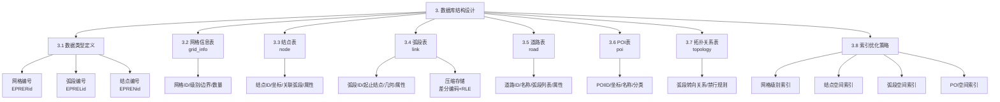

```mermaid
graph TD
    A[3. 数据库结构设计] --> B[3.1 数据类型定义]
    B --> B1[网格编号<br/>EPRERid]
    B --> B2[弧段编号<br/>EPRELid]
    B --> B3[结点编号<br/>EPRENid]
    A --> C[3.2 网格信息表<br/>grid_info]
    C --> C1[网格ID/级别/边界/数量]
    A --> D[3.3 结点表<br/>node]
    D --> D1[结点ID/坐标/关联弧段/属性]
    A --> E[3.4 弧段表<br/>link]
    E --> E1[弧段ID/起止结点/几何/属性]
    E --> E2[压缩存储<br/>差分编码+RLE]
    A --> F[3.5 道路表<br/>road]
    F --> F1[道路ID/名称/弧段列表/属性]
    A --> G[3.6 POI表<br/>poi]
    G --> G1[POIID/坐标/名称/分类]
    A --> H[3.7 拓扑关系表<br/>topology]
    H --> H1[弧段转向关系/禁行规则]
    A --> I[3.8 索引优化策略]
    I --> I1[网格级别索引]
    I --> I2[结点空间索引]
    I --> I3[弧段空间索引]
    I --> I4[POI空间索引]
```

