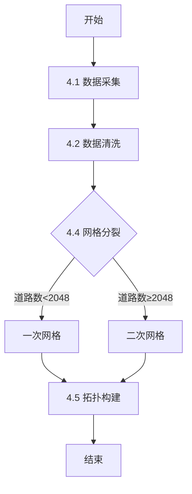

```mermaid
graph TD
    A[开始] --> B[4.1 数据采集]
    B --> C[4.2 数据清洗]
    C --> D{4.4 网格分裂}
    D -- "道路数<2048" --> E[一次网格]
    D -- "道路数≥2048" --> F[二次网格]
    E --> G[4.5 拓扑构建]
    F --> G
    G --> H[结束]
```

