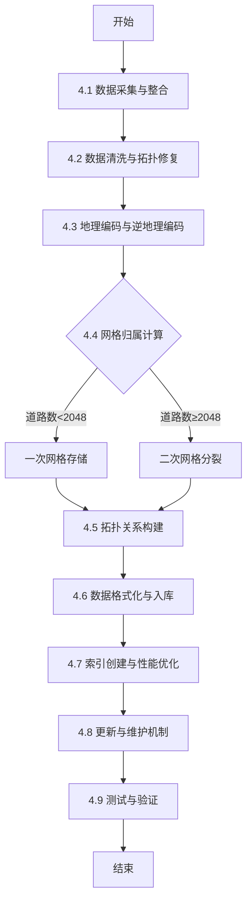

```mermaid
graph TD
    A[开始] --> B[4.1 数据采集与整合]
    B --> C[4.2 数据清洗与拓扑修复]
    C --> D[4.3 地理编码与逆地理编码]
    D --> E{4.4 网格归属计算}
    E -- "道路数<2048" --> F[一次网格存储]
    E -- "道路数≥2048" --> G[二次网格分裂]
    F --> H[4.5 拓扑关系构建]
    G --> H
    H --> I[4.6 数据格式化与入库]
    I --> J[4.7 索引创建与性能优化]
    J --> K[4.8 更新与维护机制]
    K --> L[4.9 测试与验证]
    L --> M[结束]
```

