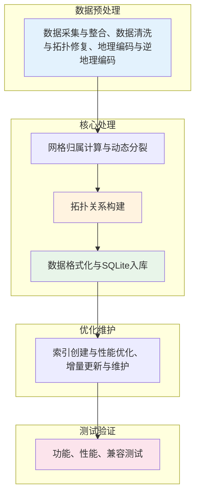

# 技术方案流程图

---

## 技术方案核心要点

| 步骤 | 核心技术 | 解决的技术问题 |
|------|----------|----------------|
| （一）数据采集与整合 | 多源数据格式转换、坐标统一 | 数据来源分散、格式不统一 |
| （二）数据清洗与拓扑修复 | 重复剔除、断链修复 | 数据存在重复、错误及拓扑断裂 |
| （三）地理编码与逆地理编码 | 地址分词、最近道路搜索 | 地址与坐标无法互转 |
| （四）网格归属计算与动态分裂 | 两级网格体系、2048动态阈值 | 数据体积庞大、查询效率低 |
| （五）拓扑关系构建 | 网格内/跨网格拓扑 | 跨区域路径规划复杂 |
| （六）数据格式化与SQLite入库 | 正规化坐标、几何压缩、SQLite存储 | 存储结构不适应终端环境 |
| （七）增量更新与维护 | 网格级更新、三种传输方式 | 更新困难、需整体替换 |
| （八）测试验证 | 功能/性能/兼容性测试 | 验证数据正确性与性能指标 |

---

## 发明点总结

1. **两级网格体系**：一次网格（经差1°×纬差40′）+ 8×8二次网格细分
2. **动态分裂规则**：道路数量≥2048自动触发二次网格划分
3. **正规化坐标**：精度1/65536，存储空间节省40%~60%
4. **几何压缩**：差分编码+RLE，压缩比3:1~5:1
5. **SQLite轻量级存储**：单文件数百KB，满足终端资源限制
6. **跨网格拓扑关系**：支持跨区域路径规划
7. **网格级增量更新**：更新量减少70%以上
