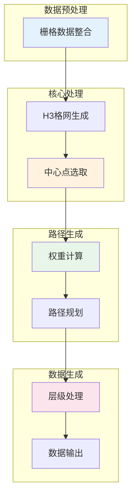

# 技术方案流程图

```mermaid
flowchart TD
    subgraph 数据预处理
        A[栅格数据整合]
    end

    subgraph 核心处理
        A --> B[H3格网生成]
        B --> C[中心点选取]        
    end

    subgraph 路径生成
    	C --> D[权重计算]
        D --> E[路径规划]
    end

    subgraph 数据生成
        E --> F[层级处理]
        F --> G[数据输出]
    end

    style A fill:#e3f2fd
    style C fill:#fff3e0
    style D fill:#e8f5e9
    style F fill:#fce4ec

  
```

